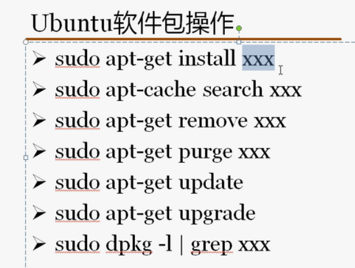

## Ubuntu 16.04下Samba相关配置:
- http://www.linuxidc.com/Linux/2016-12/138498.htm
- 注意：
  - 在完成上面教程的操作后，记得执行`sudo smbpasswd -a share`为该用户设置一个密码
  - 如果执行`sudo useradd share -u 6000 -s /shin/nologin -d /dev/null`,则执行`useradd share -u 6000 -g 6000 -s /sbin/nologin -d /dev/null`就行

## Ubuntu下SSH安装或设置:
- http://www.linuxidc.com/Linux/2013-07/87368.htm

## Ubuntu下Git的安装与使用:
- http://www.linuxidc.com/Linux/2016-09/135527.htm

## Ubuntu 16.04安装QQ国际版图文详细教程
- http://www.linuxidc.com/Linux/2016-09/134923.htm

##  Ubuntu 16.04 安装网易云音乐 
- http://blog.csdn.net/seekn/article/details/54599999
- 注意：在更换源的时候记得覆盖其中的内容

## Ubuntu 16.04下安装64位谷歌Chrome浏览器
- http://www.linuxidc.com/Linux/2016-05/131096.htm

## Ubuntu 16.04安装和配置Sublime Text 3 
- http://blog.csdn.net/frank_wangjianliang/article/details/51226807
- 注意：
  - 其中的3、安装SulimeClang 插件部分可以不用看
  - 插件的配置可以参考`http://www.cnblogs.com/unflynaomi/archive/2016/07/25/5704293.html`中的安装 Anaconda （蟒蛇）python插件部分

## ubuntu16.04安装pycharm
- http://blog.csdn.net/apple9005/article/details/52900335
- http://www.cnblogs.com/seamount/archive/2017/08/10/7340452.html
- 注意：在该教程中直接参考"安装pycharm.sh"部分即可

## ubuntu16.04安装ngnix
- http://www.cnblogs.com/piscesLoveCc/p/5794926.html

## ubuntu16.04安装virtualenv 
- http://blog.csdn.net/wxyangid/article/details/53308865(为python3创建虚拟环境)
- http://blog.csdn.net/kongxx/article/details/51858153(为python2创建虚拟环境)

## Ubuntu 16.04安装Markdown编辑器MarkMyWords
- http://www.cnblogs.com/EasonJim/p/7243033.html

## Ubuntu16.04安装PostgreSQL并使用pgadmin3管理数据库_图文详解 
- http://blog.csdn.net/caib1109/article/details/51582663

## 使用u盘安装ubunt 16.04系统教程
- http://www.linuxidc.com/Linux/2016-04/130520.htm

## 安装搜狗输入法
- http://pinyin.sogou.com/linux/
- http://blog.csdn.net/ljheee/article/details/52966456

## 如何Python写一个安卓APP 
- http://blog.csdn.net/heivy/article/details/50585118

## Nginx+Django+Uwsgi架构部署
- http://www.linuxidc.com/Linux/2014-09/106928.htm
- http://blog.aizhet.com/Linux/12608.html

## Ubuntu 16.04下安装MySQL
- http://www.linuxidc.com/Linux/2017-06/144805.htm

## ubuntu安装EnvironmentError: mysql_config not found错误
- http://blog.csdn.net/ping523/article/details/54289398


## Ubuntu软件包桌面程序以及增强工具

- apt：高级打包工具


- 软件仓库，软件源改为163的

```
1、修改/etc/apt目录下的sources.list文件，在网络上搜索163软件源，并复制到该文件中（记得做备份操作）
2、更新源
sudo apt-get update
3、升级软件
sudo apt-get upgrade
```

- 桌面安装



```
1、查找桌面
sudo apt-cache search ubuntu-desktop
2、并选择相应的桌面安装
sudo apt-install ubuntu-desktop
3、sudo apt-get purge xxx 彻底删除软件包
```

- 以原始的方式安装jdk软件

  - 配置环境变量：配置到/etc/environment文件

    ```
    JAVA_HOME="java的路径"
    PATH="/usr/local/sbin:/usr/local/bin:/usr/sbin:/usr/bin:/sbin:/bin:/usr/games:/usr/local/games:java的路径/bin"
    ```
   - 让该文件生效 
     - source environment
   - 打印java的

## Hadoop安装

- hadoop下载
- Hadoop安装
- 配置HADOOP_INSTALL和PATH环境变量

  - 不用设置HADOOP_HOME，后面不要带斜线


- 测试安装：hadoop version

Hadoop配置模式

- 独立模式
  - 没有运行的守护程序，所有程序运行在JVM中。适合开发期间运行MapReduce程序，源于它的易于测试和调试。
  - ./hadoop fs -ls / 该命令表示显示当前的目录
- 伪分布式
  - 守护进程运行在本机主机，模拟一个小规模的集群。
- 完全分布式
  - 守护进程运行在多个主机上的集群。
- 海量数据（存储、运算）
- jps查看java进程